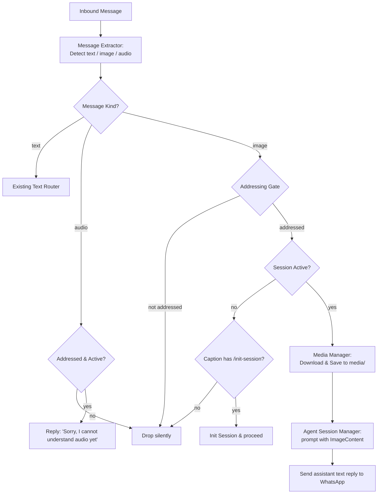

# Non-Text Media Processing Plan (Images & Audio)

**Authoritative Spec Reference:** `docs/wa-assistant-srd.md` (§13 Open Questions & Future Extensions)  
**Methodology:** Strict TDD with Vitest per `docs/dev-rules.md`  
**Scope:** Inbound image processing (multimodal prompting + local persistence) and graceful audio/voice-note rejection. Voice transcription is explicitly deferred.

---

## 1. Requirements & User Experience

### 1.1 Audio & Voice Notes
- **Deferred Feature:** Speech-to-text / voice transcription is skipped for this phase.
- **Handling Behavior:** When an audio message or voice note (`audioMessage` / PTT) is received in an active chat:
  - If addressed (DM, <=2 participant group, or @-tagged in >2 participant group): reply politely with a canned notice:
    > *"Sorry, I cannot understand audio or voice notes yet. Please send a text message or image."*
  - If unaddressed or in an uninitialized chat: silent drop (zero observable response, adhering to SRD §3.1).

### 1.2 Images
- **Multimodal Understanding:** When an image (`imageMessage`) is received in an active, addressed chat:
  - Download binary image buffer from WhatsApp via Baileys.
  - Persist the image to durable storage under that session's directory.
  - Format the image as a standard Pi SDK `ImageContent` object (`data: base64`, `mimeType`).
  - Pass the image into `session.prompt(promptText, { images: [imageContent], streamingBehavior: "followUp" })`.
  - If the message has an accompanying caption, use it as `promptText`; otherwise, default to a standard placeholder like `"[User attached an image]"`.
  - Send the assistant's multimodal response back into the WhatsApp chat.
- **Uninitialized Chats:** If an image is sent to an uninitialized chat (even with a caption like `/init-session ...`), the gatekeeper maintains stealth: images alone cannot initiate sessions, or if the caption contains `/init-session <secret>`, the session is initialized and the image is processed.

---

## 2. File Persistence & Storage Layout

### 2.1 Directory Structure
Each session already has a persistent folder: `DATA_DIR/sessions/<session-uuid>/`. Media is stored in a dedicated `media/` subfolder per session:

```
/data/sessions/<session-uuid>/
├── meta.json
├── pi-session/
├── storage.sqlite
├── storage-backups/
├── schedules.sqlite
└── media/                              # Inbound session media
    ├── <message-id>.<ext>              # e.g. 3EB09F2A.jpg
    └── media-index.json                # Optional metadata index (size, timestamp, mtime)
```

### 2.2 Storage Lifecycle & Safety Rails
1. **Durable File Naming:** Files are named using their unique WhatsApp `messageId` plus detected extension (e.g. `.jpg`, `.png`, `.webp`).
2. **Access for Tools:** Persisting the file to `media/<message-id>.<ext>` gives the agent's built-in tools (`bash`, `read`, Python scripts) the ability to inspect the raw file on disk if the model decides to run local analysis (e.g. OCR, resizing, EXIF inspection).
3. **Retention & Auto-Pruning:** To prevent disk exhaustion on the host volume:
   - Cap maximum stored media items per session: default `MAX_MEDIA_PER_SESSION = 50` (configurable via env).
   - On each new media download, prune oldest media files exceeding the cap by sorting by `mtime`.
4. **File Size Bounds:**
   - Enforce an upper bound on downloadable images (e.g. `MAX_IMAGE_BYTES = 10 * 1024 * 1024` / 10MB) to prevent memory exhaustion in the Node.js process.

---

## 3. Model Processing & Multimodal Injection

### 3.1 Pi SDK Multimodal Contract
In `@earendil-works/pi-coding-agent`, `AgentSession.prompt(text, options)` accepts:
```ts
export interface PromptOptions {
  images?: ImageContent[];
  streamingBehavior?: "steer" | "followUp";
  // ...
}

export interface ImageContent {
  type: "image";
  data: string; // Base64 string without data URL prefix
  mimeType: string; // e.g. "image/jpeg", "image/png"
}
```

### 3.2 Processing Pipeline
1. **Baileys Media Download:**
   ```ts
   import { downloadMediaMessage } from "@whiskeysockets/baileys";

   const buffer = await downloadMediaMessage(
     rawMessage,
     "buffer",
     {},
     { logger, reuploadRequest: sock.updateMediaMessage }
   );
   ```
2. **Persistence & Base64 Encoding:**
   - Save `buffer` to `DATA_DIR/sessions/<uuid>/media/<messageId>.<ext>`.
   - Encode buffer to base64: `buffer.toString("base64")`.
3. **Prompt Composition:**
   - If caption exists: `promptText = caption`.
   - If no caption: `promptText = "[User sent an image]"`.
   - Append note about local filepath for agent tool reference:
     `"[Image saved locally to ./media/<filename>]"`.
4. **Prompt Execution:**
   ```ts
   await session.prompt(promptText, {
     images: [
       {
         type: "image",
         data: base64Data,
         mimeType: detectedMimeType,
       },
     ],
     streamingBehavior: "followUp",
   });
   ```

---

## 4. Architecture & Component Changes



### 4.1 `src/message-extractor.ts`
- Extend `ExtractedMessage` interface:
  ```ts
  export type MessageKind = "text" | "image" | "audio";

  export interface ExtractedMessage {
    chatJid: string;
    senderJid: string;
    fromMe: boolean;
    messageId: string;
    kind: MessageKind;
    text: string; // text body or caption
    mentionedJids: string[];
    rawMessage?: proto.IWebMessageInfo;
    mediaInfo?: {
      mimeType: string;
      seconds?: number; // for audio
      isPtt?: boolean;   // true for voice note
    };
  }
  ```
- Unpack `msg.message.imageMessage` (and viewOnce wrappers): extract `caption`, `mimetype`.
- Unpack `msg.message.audioMessage`: extract `mimetype`, `ptt`, `seconds`.

### 4.2 `src/media-manager.ts` (New Component)
- Responsible for:
  - Downloading media streams/buffers from Baileys using `downloadMediaMessage`.
  - Writing files to `sessions/<uuid>/media/<messageId>.<ext>`.
  - Pruning media directory to maintain `MAX_MEDIA_PER_SESSION`.
  - Returning `{ filePath, base64Data, mimeType }`.

### 4.3 `src/session-gatekeeper.ts`
- Add handling for `kind === "audio"`:
  - In active chats: return `{ type: "reply", text: "Sorry, I cannot understand audio or voice notes yet. Please send a text message or image." }`.
  - In uninitialized chats: return `{ type: "drop" }`.
- Add handling for `kind === "image"`:
  - If caption contains `/init-session`: initialize session first.
  - Forward media payload to `AgentSessionManager`.

### 4.4 `src/agent-session-manager.ts`
- Update `deliverMessage`:
  - Accept optional `images?: ImageContent[]`.
  - Pass `images` to `session.prompt(text, { images, streamingBehavior: "followUp" })`.

---

## 5. Phased Implementation & TDD Gate Plan

Following `docs/dev-rules.md`, implementation will follow strict TDD phases:

1. **Phase M1 — Extractor & Audio Notice (Failing tests first):**
   - Unit tests in `tests/media-extractor.test.ts` for `imageMessage` and `audioMessage` unpacking.
   - Unit tests in `tests/session-gatekeeper-media.test.ts` for audio rejection notice in active chats vs silent drop in unaddressed chats.
   - Implement extractor and audio rejection handling. Verify green.

2. **Phase M2 — Media Manager & Persistence (Failing tests first):**
   - Unit tests in `tests/media-manager.test.ts` for saving media buffer to `sessions/<uuid>/media/`, extension detection, and max-file auto-pruning.
   - Implement `MediaManager`. Verify green.

3. **Phase M3 — Multimodal Prompting Integration (Failing tests first):**
   - Integration tests in `tests/multimodal-delivery.test.ts` verifying that images pass through the gatekeeper, download via `MediaManager`, format as `ImageContent`, and deliver into `session.prompt()` with `{ streamingBehavior: "followUp" }`.
   - Update `AgentSessionManager.deliverMessage` and `src/index.ts` handler. Verify green.

4. **Phase M4 — Hardening & Regressions:**
   - Permanent regression tests for oversized image clamping, corrupted image downloads, and empty captions.
   - Verify all gates (`npm run check:types`, `npm test`, `npm run build`, Docker build).
