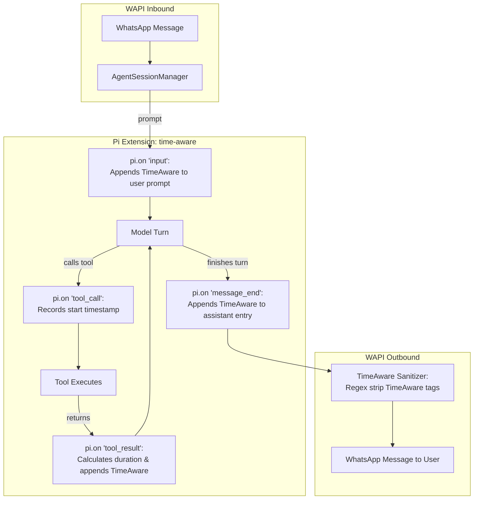

# Time-Aware Agents (Timestamp & Duration Injection) — Design & Implementation Plan

**Authoritative Context:** WhatsApp Personal Assistant (`wapi`) & Pi Agent Harness (`@earendil-works/pi-coding-agent`)  
**Status:** Proposed Architecture & Phased Plan  
**Target File:** `docs/time-aware-agents-plan.md`

---

## 1. Problem Statement & Motivation

Large Language Models do not possess an internal real-time clock. In a multi-turn conversation or persistent assistant session:
1. The model cannot infer whether a user replied in 5 seconds, 5 hours, or 5 days.
2. The model cannot determine how long tool calls took (e.g., whether a command hung for 30 seconds or finished in 10ms).
3. The model struggles with relative time queries (*"what did I do earlier today"*, *"how long since we started this"*, *"remind me in 10 minutes"*).

By injecting structured, machine-parseable `<TimeAware>` tags into **user inputs**, **tool results**, and **agent responses**, the agent maintains full temporal grounding across sessions, tool executions, and scheduled wake-ups.

---

## 2. Formatting Specification

### 2.1 Enclosing Tag
All time metadata is enclosed in an explicit XML-style container tag:
```xml
<TimeAware>...</TimeAware>
```
- **Visibility:** Visible to the model in the conversation transcript.
- **WhatsApp Sanitization:** Automatically stripped by the transport layer before any message is sent to the user on WhatsApp.

### 2.2 Datetime & Delta Formatting
1. **Datetime:** Strict ISO 8601 UTC string:
   - Example: `2026-09-27T11:20:00.000Z`
2. **Time Delta:** Human-readable breakdown (days, hours, minutes, seconds):
   - Example: `"2 hours 23 minutes 6 seconds ago"` (or `"just now"` if < 1s).
   - Rules:
     - Only include non-zero units (e.g., `"15 minutes 3 seconds"` instead of `"0 days 0 hours 15 minutes 3 seconds"`).
     - Standard unit plurals (`"1 hour"` vs `"2 hours"`).

### 2.3 Injection Formats

#### A. Standard Time Notice (User Inputs & Agent Responses)
```
<TimeAware>Time is ${datetime} (${timeSinceStart} since session started, ${timeSinceLastMessage} since previous message)</TimeAware>
```
*Example:*
```xml
<TimeAware>Time is 2026-09-27T11:20:00.000Z (2 hours 23 minutes 6 seconds since session started, 14 minutes 2 seconds since previous message)</TimeAware>
```

#### B. Tool Call Duration Notice (Tool Results)
```
<TimeAware>Tool took ${duration} to run, finished at ${datetime}</TimeAware>
```
*Example:*
```xml
<TimeAware>Tool took 1 second 340 milliseconds to run, finished at 2026-09-27T11:20:01.340Z</TimeAware>
```

---

## 3. Placement & Prompt Cache Preservation

LLM providers (OpenAI, Anthropic, OpenCode Go) utilize **prefix-based prompt caching**:
- If dynamic timestamps are inserted at the **beginning** of historical messages, the cache prefix invalidates on every turn, causing cache misses and multiplying inference costs.
- Appending the `<TimeAware>` notice at the **end** of messages and tool outputs ensures that earlier content remains an identical prefix match for caching.

### Strategy:
1. **User Messages:** Append `<TimeAware>...</TimeAware>` at the **end** of the user message. (If placed at the very start of the user message, it invalidates the current turn's prefix; placing it at the end allows any static user prompts or system prompts to remain cached).
2. **Tool Results:** Append `<TimeAware>Tool took ...</TimeAware>` at the **end** of the tool's returned text content.
3. **Agent Responses:** Append `<TimeAware>Time is ...</TimeAware>` at the **end** of the assistant message transcript entry.

---

## 4. Architecture: Where Should This Be Implemented?

The architecture splits cleanly into two layers:



### Layer 1: Dedicated Pi Extension (`src/extensions/time-aware.ts`)
Implementing this as a **first-class Pi extension** using `ExtensionAPI`:
- **`session_start`**: Initializes `sessionStartTime` and `lastMessageTime = sessionStartTime`.
- **`input`**: Intercepts user prompt, calculates deltas from `sessionStartTime` and `lastMessageTime`, appends `<TimeAware>...</TimeAware>` to `text`, and updates `lastMessageTime`.
- **`tool_call` & `tool_result`**:
  - `tool_call`: Maps `toolCallId -> performance.now()`.
  - `tool_result`: Computes elapsed duration, appends `<TimeAware>Tool took ...</TimeAware>` to the text content block.
- **`message_end`**: If the completed message is role `assistant`, appends the standard time notice to the message content before persisting into session JSONL.
- **Portability:** Can be packaged as an inline extension or a shared extension under `pi-agent-home/extensions/time-aware.ts`.

### Layer 2: WAPI Transport Sanitizer (`src/time-aware-sanitizer.ts`)
- A simple pure function: `stripTimeAwareTags(text: string): string`.
- Strips any `<TimeAware>.*?</TimeAware>` markup (including multiline variants and redundant whitespace).
- Run on `session.getLastAssistantText()` before calling `waLink.sendMessage()`.

---

## 5. Phased Implementation Plan

Following `docs/dev-rules.md`, implementation will proceed in 4 test-driven phases:

### Phase T1 — Formatter & Sanitizer Utilities
- **Failing tests first:** `tests/time-aware-formatter.test.ts`.
- **Implement:**
  - `formatTimeDelta(ms: number): string` (formats ms into `"2 hours 23 minutes 6 seconds ago"` / `"just now"`).
  - `formatStandardTimeNotice(params): string`.
  - `formatToolDurationNotice(params): string`.
  - `stripTimeAwareTags(text: string): string`.
- **Exit condition:** Unit tests green, all format edge cases verified.

### Phase T2 — Pi Extension Implementation
- **Failing tests first:** `tests/time-aware-extension.test.ts`.
- **Implement:**
  - `registerTimeAwareExtension(options): (pi: ExtensionAPI) => void`.
  - Wire `input` hook with deltas and ISO 8601 formatting.
  - Wire `tool_call` and `tool_result` hooks with duration calculation.
  - Wire `message_end` hook for assistant turns.
- **Exit condition:** Extension tests verifying transcript modification across inputs, tools, and outputs.

### Phase T3 — WAPI Integration & Delivery Filtering
- **Failing tests first:** `tests/time-aware-delivery.integration.test.ts`.
- **Implement:**
  - Attach `time-aware` extension factory in `AgentSessionManager.getOrCreateSession`.
  - Apply `stripTimeAwareTags` in `AgentSessionManager.deliverMessage` before WhatsApp sending.
- **Exit condition:** Integration test proving the model transcript sees `<TimeAware>`, but the WhatsApp output is clean.

### Phase T4 — Verification & Hardening
- **Regression tests:** Tool errors, non-text tool results, clock skew/negative delta clamping.
- **Run all gates:** `tsc --noEmit`, `vitest run`, `build`, Docker build.
- **Update documentation:** `docs/status.md`, `docs/journal.md`, `docs/report.md`.
