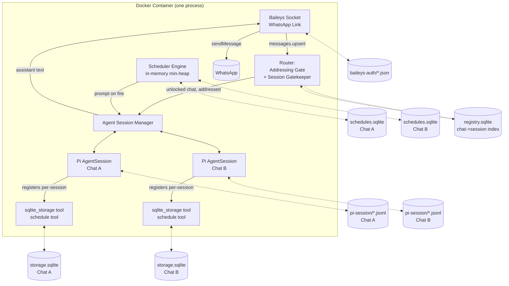
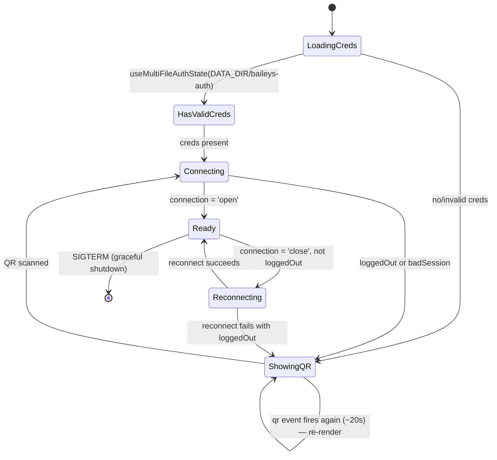
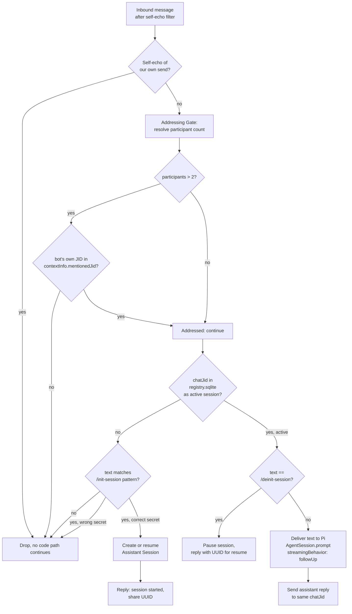
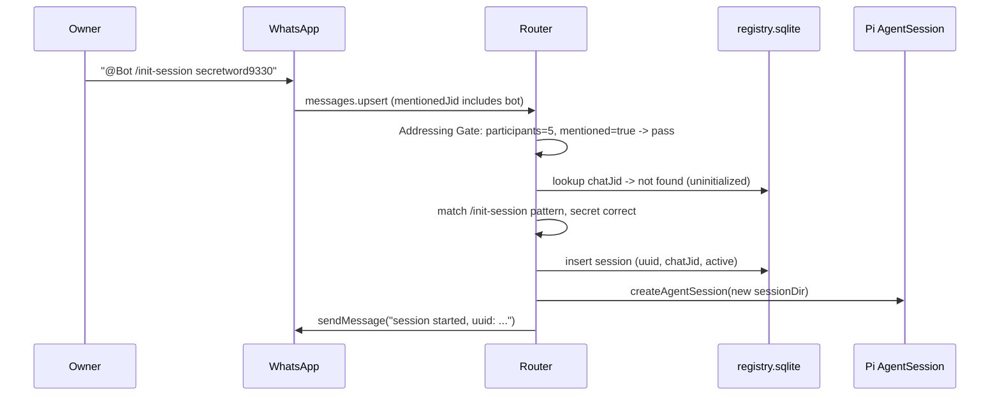
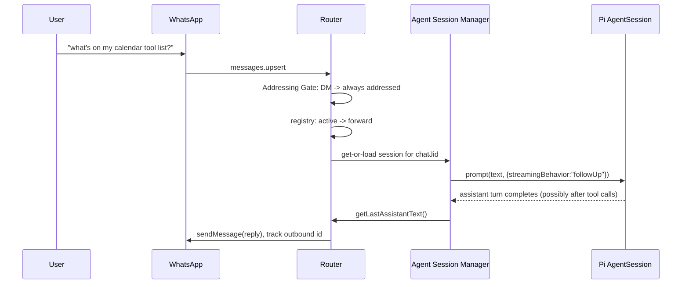
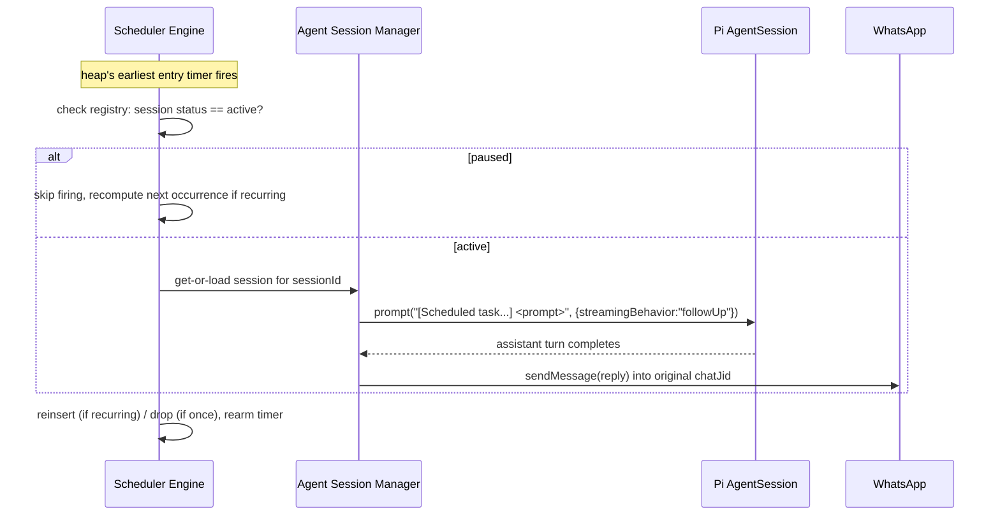

# WhatsApp Personal Assistant — Software Requirements & Design Document

**Version:** 0.2 (incorporates locked model id, mention-gating, scheduler/cron)
**Base technologies:** TypeScript (Node.js 24) + [Baileys](https://github.com/whiskeysockets/Baileys) (WhatsApp Web multi-device protocol) + [Pi](https://github.com/earendil-works/pi) (`@earendil-works/pi-coding-agent` SDK) as the agent harness
**Testing & Methodology:** Strict TDD with [Vitest](https://vitest.dev/) enforcing the test-first phase loop from `dev-rules.md`
**Deployment unit:** a single Docker container, single WhatsApp account, single operator

---

## 1. Purpose & Scope

This document specifies the initial core of a personal WhatsApp assistant: a Docker-deployed service that logs into one WhatsApp account (via QR pairing), stays silent everywhere by default, and only becomes an active AI agent inside specific chats that have been explicitly unlocked with a secret phrase. Once unlocked, a chat is backed by a persistent Pi agent session with its own SQLite-backed memory store and its own set of self-managed scheduled wake-ups ("cron jobs").

Everything here is scoped to **one owner, one WhatsApp account, one Docker container**. Multi-tenant, multi-account, or horizontally-scaled operation is explicitly out of scope (see §3.2).

## 2. Terminology

WhatsApp's own vocabulary and Pi's own vocabulary both use the word "session" for unrelated things, and this system adds a third. To keep the rest of the document unambiguous:

| Term | Meaning |
|---|---|
| **WhatsApp Link** | The single Baileys multi-device pairing (the QR-code login) for the one WhatsApp account this bot operates as. There is exactly one of these per deployment. Baileys itself calls this "auth state." |
| **Chat** | Any WhatsApp conversation thread the linked account can see: a 1:1 DM (JID ending `@s.whatsapp.net`) or a group (JID ending `@g.us`). |
| **Assistant Session** (or just **Session**) | Our own application-level concept: a chat that has been unlocked via `/init-session`. Each Assistant Session has its own UUID, its own Pi conversation history, its own SQLite memory database, and its own set of schedules. This is what `/init-session` / `/deinit-session` create and destroy. |
| **Pi Agent Session** | The `AgentSession` object from `@earendil-works/pi-coding-agent`'s SDK that backs one Assistant Session's conversation with the LLM. |
| **Addressing Gate** | The new pre-filter (§8.2) that decides whether an incoming message is even "spoken to" the assistant, based on group size and @-mentions. |

## 3. Goals & Non-Goals

### 3.1 Goals
- Silent by default: any chat that hasn't been unlocked produces zero observable behavior — no reply, no read receipt, no typing indicator, minimal code path.
- One secret phrase unlocks a chat into a fully capable Pi-backed agent with shell/file access inside the container, a locked LLM model, a per-session memory database, and self-schedulable wake-ups.
- Sessions and all their data survive container restarts via a single mounted folder.
- A session can be paused (`/deinit-session`) and resumed later on any chat by UUID.
- In multi-party groups, the assistant only engages when explicitly addressed (@-mentioned), so it doesn't inject itself into unrelated group chatter.

### 3.2 Non-Goals (explicitly out of scope for this core)
- Multi-user or multi-account operation. One WhatsApp Link per deployment.
- Horizontal scaling / multiple container replicas sharing state.
- Vector search / embeddings-based RAG — storage is "ultra simplistic": SQL tables the agent designs itself.
- Non-text message types (images, voice notes, documents, stickers, polls) in the initial core. Noted as a future extension point (§13).
- Fine-grained per-tool sandboxing beyond "the whole container is the sandbox boundary" (this mirrors Pi's own documented "Plain Docker" isolation pattern).

## 4. What We Learned From the Two Upstream Projects (and how it shapes the design)

A few load-bearing facts, confirmed by reading both codebases directly, that materially changed the design from a naive sketch:

- **Baileys delivers your own outgoing messages back to you.** Because the bot is a linked device on the *same* WhatsApp account as the owner's phone, anything the owner types from their phone — including the trigger phrase — arrives through the same `messages.upsert` event stream as everyone else's messages, tagged `key.fromMe: true`. So does an echo of every message *the bot itself* just sent. The router must distinguish "the owner typed this" from "I said this a second ago" by tracking the message IDs we generate, not by blanket-filtering `fromMe`.
- **There is no separate "bot contact."** The bot doesn't have its own WhatsApp number to be added to a group as a distinct participant — it's the owner's own account, linked. This is actually what makes the mention-gating feature (§8.2) work at all: "mentioning the bot" is technically "mentioning the owner's own JID" inside `contextInfo.mentionedJid`, which Baileys can see regardless of who sent the message.
- **Pi ships a first-class `opencode-go` provider** reading credentials via `modelRuntime.setRuntimeApiKey(providerId, key)` — no custom provider glue needed.
- **Pi implements the [Agent Skills spec](https://agentskills.io/specification)** (`SKILL.md` + frontmatter, progressive disclosure into the system prompt). This is exactly the "skill documentation" the requirements ask for around the SQLite tool.
- **Pi's SDK (`createAgentSession`) is built for exactly this kind of embedding**: custom tools via `pi.registerTool()` inside an extension factory, a pluggable `SessionManager` whose storage directory we fully control (this is what lets a Pi session's on-disk identity double as our own resumable-by-UUID session), and a `ModelRuntime` that can be shared across many concurrently-open `AgentSession` objects in one process.
- **`session.prompt(text)` throws if the session is mid-turn** unless you pass `{ streamingBehavior: "followUp" | "steer" }`; queuing methods (`followUp()`/`steer()`) *only* enqueue and do **not** start a turn on an idle session by themselves (confirmed by reading `agent.ts`/`agent-session.ts`: `followUp()`/`steer()` push onto a queue that's drained by an *active* run; nothing drains it if there is no active run). The uniform, race-free way to inject text into a session regardless of whether it's currently idle or streaming is:

  ```ts
  await session.prompt(text, { streamingBehavior: "followUp" });
  ```
  If idle, this behaves like a normal new turn. If busy, the option is honored and the text is queued, delivered once the current turn's tool calls finish. **This one call is used everywhere** we inject text into a session — live chat messages and scheduled wake-ups alike (§8.5).
- Pi's own containerization guide documents exactly the deployment shape requested here ("Plain Docker: run the whole `pi` process in a local container for simple isolation") — we're following the grain of the tool, not fighting it.

## 5. High-Level Architecture

One Node.js process, one Docker container, hosts:

1. A **Baileys socket** (the WhatsApp Link).
2. A **Router** that gates every inbound message (Addressing Gate → Session Gatekeeper).
3. An **Agent Session Manager**, a thin in-process registry mapping `sessionId ↔ chatJid ↔ live Pi AgentSession object`, lazily instantiating Pi `AgentSession`s from disk on first touch.
4. A **Scheduler Engine**, a single in-memory timer/min-heap that wakes sessions up on their own schedule and injects a synthetic prompt.
5. Two custom Pi tools registered per-session: `sqlite_storage` and `schedule`.



## 6. Persistent Storage Layout

Everything lives under one mounted host folder, e.g. `-v ./data:/data`.

```
/data
├── baileys-auth/                     # the WhatsApp Link — one set of creds for the whole bot
│   ├── creds.json
│   └── app-state-sync-*.json …       # written by useMultiFileAuthState()
├── registry.sqlite                   # chat JID -> session UUID -> status (active/paused), 1 row per session
└── sessions/
    └── <session-uuid>/
        ├── meta.json                 # chatJid, createdAt, label, model snapshot (for humans debugging)
        ├── pi-session/                # Pi's own SessionManager directory (JSONL transcript files)
        │   └── <pi-session-id>.jsonl
        ├── storage.sqlite            # the agent's own freeform memory DB (sqlite_storage tool)
        ├── storage-backups/          # timestamped pre-destructive-write snapshots, pruned to last N
        └── schedules.sqlite          # this session's cron/one-shot wake-ups (schedule tool)
```

Design rationale:
- **`registry.sqlite` is small and separate from everything else** — it's the only thing the Router needs to touch on the hot path for "is this chat unlocked," and it's what survives to let previously-initialized chats come back to life automatically after a restart without re-running `/init-session`.
- **`storage.sqlite` and `schedules.sqlite` are separate files**, not two tables in one DB. The `schedule` tool and `sqlite_storage` tool each only ever open their own file — this is a structural guarantee (not just a convention) that the agent can't accidentally `DROP TABLE` its own alarm clock while doing general storage housekeeping.
- **The Pi session directory is per-Assistant-Session** (`SessionManager.create(cwd, customDir)` pointed at `pi-session/` inside that session's folder), which is what makes "resume by UUID" trivial: the UUID *is* the folder name, and reopening it is `SessionManager.continueRecent(cwd, <that folder>)`.

## 7. Configuration

Four environment variables, per the requirements — locking the model on purpose since it isn't expected to change often:

| Variable | Required | Example | Purpose |
|---|---|---|---|
| `SECRET_WORD` | yes | `secretword9330` | The trigger phrase compared against `/init-session <word> [uuid]`. Treat as a credential — anyone who learns it can unlock a chat with your assistant on your own WhatsApp account. |
| `PROVIDER` | yes | `opencode-go` | Pi provider id, passed to `modelRuntime.getModel(provider, modelId)` and `modelRuntime.setRuntimeApiKey(provider, key)`. Kept generic (not hardcoded to `opencode-go`) so swapping providers later is a config change, not a code change. |
| `PROVIDER_API_KEY` | yes | `oc_...` | Credential for `PROVIDER`. Applied at startup via `modelRuntime.setRuntimeApiKey(PROVIDER, PROVIDER_API_KEY)` — this works for any provider id without us needing to know that provider's specific env-var convention (for `opencode-go` specifically, Pi's own docs say it reads `OPENCODE_API_KEY`; `setRuntimeApiKey` is the provider-agnostic equivalent). |
| `PROVIDER_MODEL_ID` | yes | e.g. a Claude or GPT-class id served by OpenCode Go | Locks the model. Resolved once at startup via `modelRuntime.getModel(PROVIDER, PROVIDER_MODEL_ID)`; the process **fails fast at startup** (before showing the QR) if the id doesn't resolve, rather than failing on the first real message. |

Secondary/optional variables (defaults chosen so the bot "just works" with only the four above set):

| Variable | Default | Purpose |
|---|---|---|
| `DATA_DIR` | `/data` | Root of the persistent volume (§6). |
| `TZ` | `UTC` | Container timezone; cron expressions in the `schedule` tool are interpreted in this timezone. |
| `LOG_LEVEL` | `info` | Pino log level for the process (Baileys itself is also pino-based, so this controls both). |
| `THINKING_LEVEL` | `medium` | Passed through to `createAgentSession({ thinkingLevel })`. |
| `MIN_SCHEDULE_INTERVAL_SECONDS` | `60` | Guardrail (§8.5.5) against runaway recurring schedules. |
| `MAX_SCHEDULES_PER_SESSION` | `25` | Guardrail against schedule spam. |
| `QR_HTTP_PORT` | unset (disabled) | If set, also serves the current QR as a PNG at `http://<host>:<port>/qr`, in addition to the terminal ASCII rendering, for easier phone-camera scanning. Not core — see §13. |

## 8. Component Design

### 8.1 WhatsApp Frontend (Baileys)

**Auth lifecycle.** On startup:



The QR is rendered to stdout via `qrcode-terminal` on every `qr` value in `connection.update` (it rotates roughly every ~20s until scanned); this satisfies "shows this and refreshes every time it expires." Logging happens after any startup diagnostics (env var validation, model resolution, registry load) print first, per the requirement that the QR is the first *interactive* thing shown but initialization logs precede it.

**Reconnection policy**, keyed off `DisconnectReason` (Baileys `src/Types/index.ts`):

| `DisconnectReason` | Value | Action |
|---|---|---|
| `connectionClosed`, `connectionLost`, `timedOut` | 428 / 408 | Reconnect immediately with jittered backoff (max ~30s). |
| `restartRequired` | 515 | Reconnect immediately, no backoff (this is Baileys' normal post-pairing restart signal). |
| `connectionReplaced` | 440 | Another session took over (e.g., WhatsApp Web opened elsewhere with a conflicting session). Log loudly, back off longer (~60s) before retrying, since immediate retry can fight the other client. |
| `loggedOut` | 401 | Do **not** reconnect. Wipe `baileys-auth/`, return to `ShowingQR`. Assistant Sessions and their data are *not* deleted — they simply have no live transport until re-paired. |
| `badSession` | 500 | Treat like `loggedOut` (creds are corrupt) — wipe and re-pair. |
| everything else | — | Reconnect with backoff; log the reason for visibility. |

**Message ingestion & self-echo suppression.** Every outbound `sock.sendMessage()` call is issued with an explicit `messageId` (via `generateMessageIDV2`), and that id is added to a short-lived `Set<string>` (evicted after a couple of minutes — long enough to cover the round-trip through WhatsApp's own multi-device sync, short enough not to leak memory). On every `messages.upsert` (type `notify`), the router:

1. Drops it immediately if `msg.key.id` is in that outbound set (it's our own echoed send).
2. Otherwise extracts text from `msg.message?.conversation ?? msg.message?.extendedTextMessage?.text` (other message types are ignored in this core — no reply, no error, just skipped).
3. Passes `{ chatJid: msg.key.remoteJid, senderJid: msg.key.participant ?? msg.key.remoteJid, fromMe: msg.key.fromMe, mentionedJids: msg.message?.extendedTextMessage?.contextInfo?.mentionedJid ?? [], text }` to the Router.

Note explicitly: `fromMe: true` is **not** used as a general "ignore" signal (only the message-id echo check is). The owner's own typed messages are the primary way they talk to their own assistant, and per §8.2 they're gated identically to anyone else's messages.

### 8.2 The Router: Addressing Gate → Session Gatekeeper

This is the full decision pipeline every non-echoed inbound message passes through, in order. Each stage is cheap and fails closed (silence) by default.



**8.2.1 Addressing Gate.** Participant count is resolved as:
- DM (`isJidGroup(chatJid) === false`): always 2 (the owner + the other party) — no mention ever required. This covers "if its a dm... just talk directly."
- Group with `participants.length <= 2` (the owner + at most one other real member): treated the same as a DM — no mention required. This covers "a group with only one other member... just talk directly."
- Group with `participants.length > 2`: a message only counts as "addressed" if `jidNormalizedUser(sock.user.id)` appears in that message's `contextInfo.mentionedJid` (normalized the same way, since mentioned JIDs and `sock.user.id` can carry a `:device` suffix that must be stripped before comparing). This applies uniformly to **every** sender in that group, the owner included — group size, not sender identity, is what decides whether a mention is required. There is deliberately no "owner bypass": it keeps the rule simple and matches the requirement's literal wording.

Group metadata (`sock.groupMetadata(jid)`) is fetched through Baileys' recommended `cachedGroupMetadata` option (a `NodeCache`), invalidated on `groups.update`/`group-participants.update` events, so the common case (message in a group we've already seen) costs zero network round-trips.

**8.2.2 Session Gatekeeper.** `registry.sqlite` (schema below) is the single source of truth for "is this chat unlocked."

```sql
CREATE TABLE sessions (
  id            TEXT PRIMARY KEY,      -- uuid, also the folder name under sessions/
  chat_jid      TEXT NOT NULL UNIQUE,  -- one active session per chat at a time
  status        TEXT NOT NULL CHECK (status IN ('active','paused')),
  created_at    TEXT NOT NULL,
  last_active_at TEXT NOT NULL
);
```

- **Uninitialized chat:** the only thing that can possibly produce a reply is a message whose trimmed text matches `/^\/init-session\s+(\S+)(?:\s+([0-9a-f-]{36}))?$/i`. Anything else — including bare `/`, `/init`, `/init-session` with no args, or a correct-looking command with the *wrong* word — is dropped with **zero observable difference** from an ordinary ignored message: no reply, no read receipt, no typing indicator, no log line above debug. This is deliberate: an attacker probing the bot must not be able to distinguish "wrong secret" from "not a command at all" from "chat is unaddressed."
  - Correct secret, no UUID → **new** Assistant Session: generate a UUID, create its folder, create its Pi `SessionManager` (fresh), create empty `storage.sqlite`/`schedules.sqlite`, insert into `registry.sqlite` as `active`, reply with a short confirmation including the new UUID ("session started — save this id to resume it later: `<uuid>`").
  - Correct secret + UUID → **resume**: if `sessions/<uuid>/` exists (regardless of its previous `chat_jid`, since resuming into a *different* chat is allowed and matches "you can continue the session by doing..."), re-point its `chat_jid` to the current chat, set `status='active'`, reopen its Pi session via `SessionManager.continueRecent(cwd, sessions/<uuid>/pi-session)`, and fire any one-shot schedules that were missed while paused (§8.5.4). If the UUID doesn't exist, treat it like a bare wrong secret — silently drop (don't leak whether a UUID is valid).
- **Active chat:**
  - `/deinit-session` (exact match after trim) → set `status='paused'` in the registry, dispose the live Pi `AgentSession` object (keeping its on-disk data intact), and reply in the style of exiting a Pi CLI session: a short goodbye plus the UUID, e.g. "session paused. Resume anytime with `/init-session <secret> <uuid>`." The chat immediately returns to being treated as uninitialized for all subsequent messages.
  - `/init-session ...` sent again while already active → not silently dropped (the chat is already awake, so a small reply doesn't violate the "silence" requirement, which only applies to *uninitialized* chats) — reply with "already active" and its UUID.
  - Anything else → forwarded to the Agent Session Manager (§8.3).

### 8.3 Agent Runtime (Pi Integration)

**Startup (once per process):**

```ts
const modelRuntime = await ModelRuntime.create({
  authPath: path.join(DATA_DIR, "pi-agent-home", "auth.json"),
  modelsPath: path.join(DATA_DIR, "pi-agent-home", "models.json"),
});
await modelRuntime.setRuntimeApiKey(PROVIDER, PROVIDER_API_KEY);

const model = modelRuntime.getModel(PROVIDER, PROVIDER_MODEL_ID);
if (!model) {
  throw new Error(
    `Configured model "${PROVIDER}/${PROVIDER_MODEL_ID}" was not found. ` +
    `Check PROVIDER / PROVIDER_MODEL_ID before the QR will be shown.`
  );
}
```

`pi-agent-home` is a single shared directory (not per-session) under the mounted volume: it holds Pi's model catalog cache and any Pi-level settings, and is also where the *shared* skill lives (`pi-agent-home/skills/sqlite-storage/SKILL.md`, baked into the Docker image at build time and copied in on first boot if absent). Skills are discovered automatically by every session's `DefaultResourceLoader` because they all share this one `agentDir` — we never need to duplicate the skill file per session.

**Per-Assistant-Session, lazily on first message (or on `/init-session`):**

```ts
function loadOrCreateAgentSession(sessionDir: string, chatJid: string) {
  const dbPath = path.join(sessionDir, "storage.sqlite");
  const schedDbPath = path.join(sessionDir, "schedules.sqlite");

  const resourceLoader = new DefaultResourceLoader({
    cwd: sessionDir,
    agentDir: SHARED_AGENT_DIR,               // shared skills/config; see above
    appendSystemPromptOverride: (base) => [
      ...base,
      renderAssistantPreamble({ chatJid }),   // brief, session-scoped context
    ],
    extensionFactories: [
      registerSqliteStorageTool(dbPath),      // §8.4 — closes over THIS session's db file only
      registerScheduleTool(schedDbPath, sessionId, scheduler), // §8.5
    ],
  });
  await resourceLoader.reload();

  return createAgentSession({
    cwd: sessionDir,
    agentDir: SHARED_AGENT_DIR,
    model,
    thinkingLevel: THINKING_LEVEL,
    modelRuntime,
    resourceLoader,
    tools: ["read", "write", "edit", "bash", "grep", "find", "ls"], // full built-in set
    sessionManager: SessionManager.create(sessionDir, path.join(sessionDir, "pi-session")),
  });
}
```

The built-in tool set is enabled in full (bash included) — the requirements are explicit that the container itself *is* the sandbox boundary for this single-user deployment, matching Pi's own "Plain Docker" isolation pattern.

**Delivering text into a session — the one code path used by both live chat and the scheduler:**

```ts
async function deliver(session: AgentSession, chatJid: string, text: string) {
  await sock.sendPresenceUpdate("composing", chatJid);
  try {
    await session.prompt(text, { streamingBehavior: "followUp" });
    const reply = session.getLastAssistantText();
    if (reply?.trim()) {
      const id = generateMessageIDV2(sock.user?.id);
      trackOutboundId(id);
      await sock.sendMessage(chatJid, { text: reply }, { messageId: id });
    }
  } finally {
    await sock.sendPresenceUpdate("paused", chatJid);
  }
}
```

As established in §4, `{ streamingBehavior: "followUp" }` is correct whether the session is idle (runs immediately, option ignored) or already mid-turn (queued safely, delivered once current tool calls settle) — this is exactly what lets a scheduled wake-up and a live incoming message both target the same session without us hand-rolling busy/idle tracking.

Very long replies (well past comfortable single-bubble length) are chunked at ~4000 characters on paragraph boundaries before sending, to avoid one giant wall-of-text bubble.

### 8.4 SQLite Storage Tool & Skill

**Design choice:** a purpose-built tool (`sqlite_storage`) rather than "just give it `bash` + the `sqlite3` CLI," even though `bash` is available anyway. Reasons:
1. The tool closes over *this session's own* `storage.sqlite` path — the agent structurally cannot point it at another session's database or at an arbitrary file, whereas with raw `bash` it's trusted to always type the right path.
2. Rows come back as JSON, not a piped/parsed CLI table — cheaper and more reliable for the model to consume.
3. It's where the safety rails (auto-backup before destructive statements, row/byte caps, WAL mode, transaction wrapping) live as actual code, not as instructions the model has to remember to follow every time.

`bash` remains available for anything the tool doesn't cover (e.g., manually inspecting the raw file, running `VACUUM`), so nothing is lost — the tool is just the paved, recommended path, which is exactly what the skill documents.

**Tool contract:**

| Action | Params | Behavior |
|---|---|---|
| `schema` | — | Returns every table's `CREATE TABLE` statement from `sqlite_master`, plus row counts. The recommended first call in any new conversation touching storage. |
| `all` | `sql`, `params?` | Single parameterized `SELECT`/`PRAGMA`/`EXPLAIN` statement (`db.prepare(sql).all(params)`). Rejected if it isn't one of those three verbs. Result rows capped (default 200 rows / ~8000 chars serialized), with a clear "truncated, narrow your query" notice appended when hit. |
| `run` | `sql`, `params?` | Single parameterized write statement (`INSERT`/`UPDATE`/`DELETE`/`CREATE`/`ALTER`) via `db.prepare(sql).run(params)`. Returns `{ changes, lastInsertRowid }`. |
| `exec` | `sql` | Multi-statement raw SQL (`db.exec(sql)`) for schema bootstrapping/migrations, wrapped in a single transaction so it's all-or-nothing. |
| `backup` | `label?` | Explicit `VACUUM INTO` snapshot into `storage-backups/<timestamp>-<label>.sqlite`. |

**Automatic safety rails**, implemented in the tool, not left to the model's discipline:
- `PRAGMA journal_mode = WAL` and `PRAGMA busy_timeout = 5000` set on every connection open — durability and graceful handling of any (unlikely, single-writer-in-practice) concurrent access.
- Before any `run`/`exec` whose SQL text matches `/\b(DROP\s+TABLE|DELETE\s+FROM\s+\S+(?!\s+WHERE)|ALTER\s+TABLE.*DROP\s+COLUMN)\b/i` (a heuristic keyword check, not a full SQL parser — documented as such), the tool takes an automatic `VACUUM INTO` snapshot first, exactly like the manual `backup` action.
- `storage-backups/` is pruned to the most recent N (configurable, default 10) snapshots on every write, so the volume doesn't grow unbounded.
- Thrown errors (bad SQL, disallowed verb in `all`) become `isError: true` tool results per Pi's tool contract — the model sees a clear failure, not a silently-empty result.

**Skill (`pi-agent-home/skills/sqlite-storage/SKILL.md`)**, shared by every session, baked into the image:

```markdown
---
name: sqlite-storage
description: Persistent per-conversation memory backed by SQLite. Use whenever you need to remember something across messages or sessions — notes, facts, reminders, structured records — or need to look up something you stored earlier.
---

# Persistent storage

You have a private SQLite database for this conversation (`storage.sqlite`,
accessed only through the `sqlite_storage` tool). It survives restarts. Nothing
else can read or write it — it's yours alone. There is no vector search here;
design real tables and query them with real SQL.

## Before you do anything else in a fresh conversation
Call `sqlite_storage` with `action: "schema"`. Don't assume what tables exist —
check. If nothing exists yet, that's normal; design tables as you need them.

## Design habits that avoid losing data
- Prefer a few well-named tables over one giant blob column. If you don't yet
  know the shape of what you're storing, start with a generic
  `notes(id INTEGER PRIMARY KEY, created_at TEXT, tag TEXT, body TEXT)` table
  rather than inventing throwaway schemas per message.
- Use `INSERT ... ON CONFLICT (...) DO UPDATE` for anything that should be
  "set this value" rather than "add another row" — read-modify-write races are
  rare here (one conversation, mostly one writer) but upserts are still the
  simplest way to avoid silent duplicates.
- Never `DROP TABLE` or bulk `DELETE` because a request sounds like it implies
  cleanup. Confirm with the person first if the instruction is ambiguous, and
  mention that a backup is taken automatically before any destructive
  statement (`storage-backups/`) if you do proceed.
- Use `exec` only for schema changes (`CREATE TABLE`, `ALTER TABLE`) or one-off
  multi-statement scripts. Use `run` for everyday single-statement writes so
  you get back `changes`/`lastInsertRowid` to confirm what happened.
- Large results are truncated. If `all` tells you a result was truncated,
  narrow the query (add a `WHERE`, a `LIMIT`, pick fewer columns) instead of
  assuming you saw everything.
- If you're about to do something destructive and the schema shows real data
  is at stake, call `backup` explicitly first and say so.
```

### 8.5 Scheduler / Cron System

**8.5.1 Requirement recap.** The agent can schedule itself a future wake-up — a one-off ("remind me in 30 minutes to...") or a recurring cron-style job ("every day at 8am, give me a briefing"). When it fires, the system injects the original instruction as a prompt into that same Assistant Session, and whatever the agent says in response is sent into the *same WhatsApp chat* the session belongs to — no separate notification channel. Schedules must persist across restarts and are entirely managed by the agent itself via a tool (create/list/cancel), not by the operator.

**8.5.2 Data model** (`schedules.sqlite`, one file per Assistant Session):

```sql
CREATE TABLE schedules (
  id             TEXT PRIMARY KEY,          -- uuid
  label          TEXT,                       -- short human/agent-facing name
  kind           TEXT NOT NULL CHECK (kind IN ('once','recurring')),
  cron_expr      TEXT,                       -- set iff kind='recurring' (5-field cron, TZ env var)
  prompt         TEXT NOT NULL,              -- injected into the session verbatim when it fires
  created_at     TEXT NOT NULL,
  next_fire_at   TEXT NOT NULL,              -- ISO 8601 UTC — authoritative for both kinds
  last_fired_at  TEXT,
  enabled        INTEGER NOT NULL DEFAULT 1
);
```

**8.5.3 Engine design.** A single in-process component, not one timer per schedule:

1. **Startup:** scan every `sessions/*/schedules.sqlite`, load all `enabled=1` rows. For each, normalize `next_fire_at` against "now" using the catch-up policy below, then push `{ sessionId, chatJid, scheduleId, nextFireAt }` onto one shared min-heap ordered by `nextFireAt`.
2. Arm a single `setTimeout` to the heap's earliest entry.
3. **On fire:** pop the entry. If that session is currently `paused` in `registry.sqlite`, **skip execution** (see §8.5.4) but still reschedule if recurring. Otherwise, resolve/instantiate the live `AgentSession` (via the same Agent Session Manager used for live chat) and call the exact same `deliver(session, chatJid, formattedPrompt)` helper from §8.3 — a fired schedule and an incoming WhatsApp message go through *identical* code from that point on.
   - `formattedPrompt` wraps the stored `prompt` with a clear provenance marker, e.g.: `[Scheduled task "<label>" fired at <ISO time>] <prompt>` — so the model's transcript makes it obvious this turn was self-initiated, not something the person just said.
4. If `kind='once'`: mark `last_fired_at`, set `enabled=0` (or delete the row).
   If `kind='recurring'`: compute the next occurrence strictly after now via `cron-parser`, update `next_fire_at`, re-insert into the heap.
5. Re-arm the timer to the new earliest entry.
6. Any tool-driven create/cancel updates the on-disk row *and* the heap, re-arming the timer if the change affects the current earliest entry.

`cron-parser` (npm) is used purely as a "given this expression and this instant, what's the next occurrence" function — no separate cron daemon, no polling loop; the whole engine is one heap plus one timer.

**8.5.4 Catch-up policy** (applies uniformly whether the miss was caused by the process being down, or the session being paused):
- **One-shot** schedules whose `next_fire_at` has already passed: fire exactly once, immediately, the next time that session becomes reachable (process restart, or `/init-session ... <uuid>` resume) — tagged in the prompt as a catch-up so the agent/person can tell it's late.
- **Recurring** schedules: never backfill missed occurrences. Just compute the next *future* occurrence from the current time and move on. This is a deliberate choice against the alternative (rack up every missed daily briefing and fire them all at once) — restated here since it also governs the pause/resume case in §8.2.2.

**8.5.5 Guardrails**, enforced by the `schedule` tool at creation time:
- Reject/clamp `cron_expr`s whose first two computed occurrences are less than `MIN_SCHEDULE_INTERVAL_SECONDS` apart (default 60s) — this exists specifically because a fired schedule sends a real WhatsApp message, and WhatsApp can flag accounts that send automated messages too frequently (§12).
- Cap total enabled schedules per session at `MAX_SCHEDULES_PER_SESSION` (default 25); the tool returns a clear error past that, telling the agent to cancel something first.
- A `run_at`/`run_in_seconds` in the past is not an error — it's clamped to "fire on the next engine tick," so the agent doesn't need to do its own past/future arithmetic.

**8.5.6 Tool contract** (`schedule`, registered per-session, closing over that session's `schedules.sqlite` + `sessionId`):

| Action | Params | Behavior |
|---|---|---|
| `create` | `kind`, `prompt`, `label?`, `cron_expr?` (kind=recurring), `run_at?` \| `run_in_seconds?` (kind=once) | Validates guardrails, inserts a row, updates the live heap, returns the new schedule's id and computed `next_fire_at`. |
| `list` | — | Returns all enabled schedules for *this session only* (never cross-session) with their next fire times, human-readable. |
| `cancel` | `id` | Sets `enabled=0`, removes it from the heap if present. No-op (not an error) if already canceled/fired. |

No dedicated skill file is written for this tool — its action surface is small enough that the tool's own parameter descriptions plus one short paragraph appended to the system prompt (timezone note, and "a fired schedule's output goes straight to this WhatsApp chat, so make sure your response is something worth sending") are sufficient, matching Pi's own skill guidance ("use a skill when a workflow needs more context than a prompt template — but not otherwise").

Note that "the cron doesn't run a command, well it can" from the requirements is already covered without extra design: the injected prompt starts a normal agent turn with the *full* tool set (including `bash`), so a scheduled task that needs to actually check something or run something is free to call tools while handling its own wake-up — the scheduler's only job is producing the prompt and the eventual outbound message, not restricting what happens in between.

## 9. Key Sequence Diagrams

**9.1 First-ever init in a busy (>2 person) group:**



**9.2 Normal turn in an already-unlocked DM:**



**9.3 Scheduled wake-up:**



## 10. Docker Deployment

**Dockerfile** (mirrors Pi's own documented "Plain Docker" pattern, extended with `sqlite3` for manual inspection and `better-sqlite3`'s native build deps):

```dockerfile
FROM node:24-bookworm-slim

RUN apt-get update \
  && apt-get install -y --no-install-recommends \
       bash ca-certificates git python3 make g++ sqlite3 \
  && rm -rf /var/lib/apt/lists/*

WORKDIR /app
COPY package.json package-lock.json ./
RUN npm ci --omit=dev --ignore-scripts=false
COPY dist/ ./dist/
COPY pi-agent-home/ ./pi-agent-home/    # baked-in shared skill(s), copied to DATA_DIR on first boot

ENTRYPOINT ["node", "dist/index.js"]
```

**docker-compose.yml:**

```yaml
services:
  wa-assistant:
    build: .
    environment:
      SECRET_WORD: ${SECRET_WORD}
      PROVIDER: opencode-go
      PROVIDER_API_KEY: ${PROVIDER_API_KEY}
      PROVIDER_MODEL_ID: ${PROVIDER_MODEL_ID}
      TZ: ${TZ:-UTC}
    volumes:
      - ./data:/data
    restart: unless-stopped
    stdin_open: true   # so `docker attach` / `docker logs -f` shows the QR cleanly
    tty: true
```

Everything under `/data` is the entire portable state of the deployment — copying that one folder is the entire backup/migration story.

## 11. Non-Functional Requirements

- **Reliability:** the process must survive a Baileys disconnect without losing in-flight Assistant Session state (Pi session transcripts are durable JSONL, written incrementally, not held only in memory). A crash mid-tool-call should, on restart, leave the Pi session resumable from its last durable checkpoint (Pi's own compaction/durability model handles this; we don't add our own).
- **Performance:** typing indicator (`composing` presence) is sent before the Pi turn starts and cleared after, so multi-second LLM/tool latency doesn't look like a hang.
- **Observability:** structured (pino) logs for: connection state transitions, every Addressing Gate drop (debug level only — must not be noisy), every session create/pause/resume, every schedule fire, and every tool error. No message *content* is logged above debug level, out of respect for the fact this is a personal account.
- **Engineering & Test Discipline:** Implemented in TypeScript (Node.js 24, strict mode). Development follows TDD (Test-Driven Development) using Vitest as the test runner: every phase writes failing unit/integration tests first before touching implementation code, and all gates (`vitest run`, `tsc --noEmit`) must be green before commits.

## 12. Security & Risk Considerations

- **`SECRET_WORD` is a bearer credential**, not a password with rate-limiting or lockout (there's no real way to add either without breaking the "indistinguishable silence" requirement for wrong guesses). Treat it like an API key: long, random, rotated if you suspect exposure (rotation currently means an env var change + restart; already-active sessions are unaffected since the check only happens at `/init-session` time).
- **The container is the entire trust boundary.** With `bash`/`edit`/`write` enabled, an unlocked session can do anything the container's user can do, including outbound network calls. This is an accepted, explicit trade-off for a single-owner deployment — do not reuse this container image/config for a multi-user or less-trusted deployment without revisiting the tool set.
- **WhatsApp automation risk**, called out by Baileys' own maintainers: this account is not "officially" automated, and WhatsApp can rate-limit or ban accounts that send bulk/rapid automated messages. The scheduler's guardrails (§8.5.5) exist specifically to keep self-triggered messages within a sane cadence; avoid `/init-session`-ing this into large groups where it would generate high message volume.
- **Data privacy:** `storage.sqlite` may end up holding anything the owner asks the assistant to remember. It sits unencrypted on the host filesystem (via the volume mount) — protect the host the same way you'd protect any other credential store on it.
- **Backups grow, but are bounded:** `storage-backups/` auto-prunes (§8.4); nothing else in `/data` grows without an explicit action from the agent.

## 13. Open Questions / Nice-to-Haves (not core)

- **QR-over-HTTP** (`QR_HTTP_PORT`): scanning a terminal ASCII QR from `docker logs` works but is occasionally fiddly in cramped terminals; a tiny `/qr` PNG endpoint is a low-effort improvement, deliberately left optional/off-by-default since it opens a network port.
- **Non-text message types:** images, voice notes, and documents are silently ignored in this core. Voice-note transcription and image understanding are natural follow-ups once the text-only loop is solid.
- **Message chunking threshold** (~4000 chars, §8.3) is a starting guess; may want tuning once real usage shows how verbose typical replies are.
- **Custom message role for scheduled wake-ups:** currently a plain `user`-role message with a text prefix (§8.5.3). Pi's `AgentMessage` supports custom roles via declaration merging if we later want the transcript/UI to visually distinguish "self-triggered" turns from real user turns — deferred as unnecessary complexity for the core.

## 14. Phased Implementation Plan

All phases follow strict TDD with Vitest: failing tests are written first for each component (unit tests and mocked socket/agent integration tests), followed by minimal implementations and gate verification before commit.

1. **Phase 0 — Skeleton:** Baileys connects, persists auth, shows/refreshes QR, reconnects per §8.1. No agent yet — just log every inbound message's chat/sender for manual verification of the self-echo and JID-parsing logic.
2. **Phase 1 — Core loop:** Addressing Gate + Session Gatekeeper (§8.2) fully wired to `registry.sqlite`; `/init-session` / `/deinit-session` working end-to-end; a bare Pi `AgentSession` per Assistant Session (built-in tools only, no custom tools yet) so a simple chat round-trip works.
3. **Phase 2 — Memory:** `sqlite_storage` tool + skill (§8.4).
4. **Phase 3 — Scheduler:** `schedule` tool + engine (§8.5), including the pause/resume catch-up interaction with Phase 1's gatekeeper.
5. **Phase 4 — Hardening:** message chunking tuning, backup pruning verification, structured logging review, and revisiting the §13 list based on real usage.
